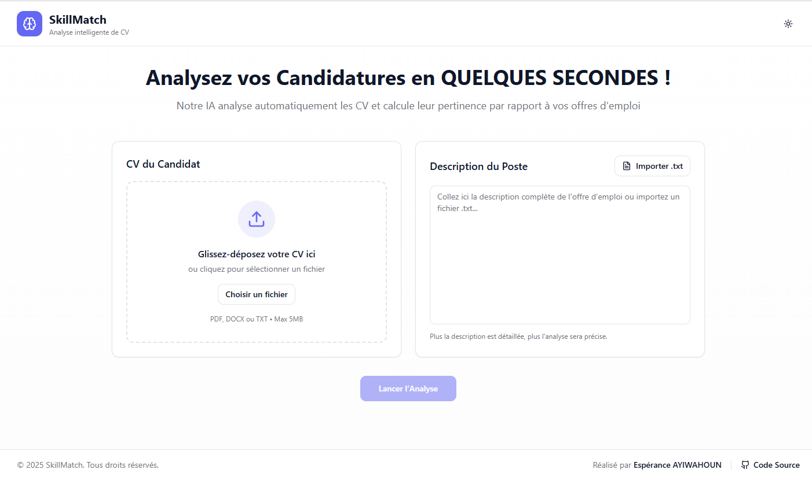
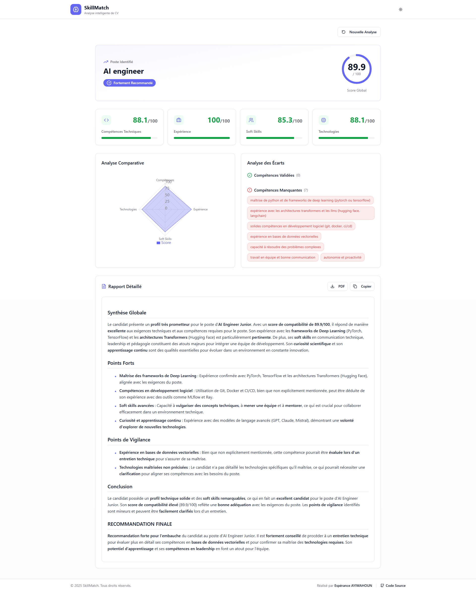

# 🤖 Skill-Match - Système d'analyse automatisée de candidatures

[](https://skill-match-iota.vercel.app)
[](https://www.python.org/)
[](https://fastapi.tiangolo.com/)
[](https://nextjs.org/)
[](LICENSE)

> Skill-Match est un agent IA intelligent pour automatiser l'analyse de CV, la classification des métiers et l'évaluation de la correspondance candidat-offre d'emploi.

---

## 📋 Table des Matières

- [✨ Fonctionnalités](#-fonctionnalités)
- [🎬 Démo](#-démo)
- [🏗️ Architecture](#️-architecture)
- [🚀 Installation](#-installation)
- [📖 Utilisation](#-utilisation)
- [📊 Exemples](#-exemples)
- [🧪 Tests](#-tests)
- [🌐 Déploiement](#-déploiement)
- [📚 Documentation](#-documentation)
- [👤 Auteur](#-auteur)

---

## ✨ Fonctionnalités

### 🎯 Analyse Intelligente de CV
- ✅ **Parsing multi-format** : PDF, DOCX, TXT
- ✅ **Extraction structurée** : Compétences techniques, soft skills, expériences, formations
- ✅ **Classification précise** : Identification parmi 120+ métiers officiels
- ✅ **Niveau de confiance** : Score de certitude sur le métier identifié

### 🔍 Analyse d'Offres d'Emploi
- ✅ Extraction des compétences requises
- ✅ Identification du niveau d'expérience demandé
- ✅ Détection des technologies et outils attendus
- ✅ Analyse des missions principales

### 🎲 Matching Intelligent
- ✅ **Scoring multi-critères** : Compétences (40%), Expérience (20%), Technologies (20%), Soft skills (20%)
- ✅ **Analyse des écarts** : Identification des compétences manquantes
- ✅ **Justification détaillée** : Transparence sur les calculs
- ✅ **Recommandation finale** : ✅ Fortement recommandé / ⚠️ À considérer / ❌ Non recommandé

### 📄 Rapport Professionnel
- ✅ Format structuré et actionnable pour recruteurs
- ✅ Export PDF (bonus)
- ✅ Visualisations graphiques (bonus)

---

## 🎬 Démo

🔗 **Application en ligne** : [https://skill-match-iota.vercel.app/](https://skill-match-iota.vercel.app/)

### Captures d'écran





---

## 🏗️ Architecture

```
┌─────────────┐      ┌──────────────┐      ┌─────────────┐
│             │      │              │      │             │
│  Frontend   │─────▶│   Backend    │─────▶│  Mistral    │
│  (React)    │      │  (FastAPI)   │      │  AI API     │
│             │◀─────│              │◀─────│             │
└─────────────┘      └──────────────┘      └─────────────┘
                             │
                             ▼
                     ┌──────────────┐
                     │   Parsers    │
                     │ (PDF, DOCX)  │
                     └──────────────┘
```

### Stack Technique

**Backend**
- 🐍 Python 3.10+
- ⚡ FastAPI (API REST)
- 🤖 LangChain + Mistral AI (LLM)
- 📄 PyPDF2, python-docx (parsing)
- 🧠 Embeddings & Vector Store (Matching intelligent)

**Frontend**
- ⚛️ React 18 avec Vite 5
- 🎨 Tailwind CSS + shadcn/ui
- 📊 Recharts (visualisations)
- 🎭 Lucide Icons
- 📝 React Markdown + remark-gfm
- 📄 jsPDF + html2canvas (export PDF)

**Déploiement**
- 🌐 Vercel (Frontend)
- 🚀 Render (Backend)
- 🐳 Docker (containerisation)

---

## 🚀 Installation

### Prérequis

- Python 3.10+
- Node.js 18+
- Clé API Mistral AI

### 1. Cloner le dépôt

```bash
git clone https://github.com/TitanSage02/SkillMatch.git
cd SkillMatch
```

### 2. Configuration des variables d'environnement

**Backend** :
```bash
cp backend/.env.example backend/.env
# Éditer backend/.env et ajouter votre clé Mistral AI
```

**Frontend** :
```bash
cp frontend/.env.example frontend/.env
# La configuration par défaut (localhost:8000) fonctionne en développement
```

### 3. Installation Backend

```bash
cd backend
python -m venv venv
source venv/bin/activate  # Windows: venv\Scripts\activate
pip install -r requirements.txt

```

### 4. Installation Frontend

```bash
cd ../frontend
npm install
```

### 5. Lancer en local

**Terminal 1 - Backend**
```bash
cd backend
uvicorn main:app --reload --port 8000
```

**Terminal 2 - Frontend**
```bash
cd frontend
npm run dev
```

🌐 Accéder à : [http://localhost:8080](http://localhost:8080)

---

## 📖 Utilisation

### Interface Web

1. **Uploader un CV** (PDF, DOCX ou TXT)
2. **Coller une offre d'emploi** (texte)
3. **Cliquer sur "Analyser"**
4. **Consulter le rapport** généré en ~20-30 secondes

### API REST

**Endpoint** : `POST /api/analyze`

**Exemple avec cURL**
```bash
curl -X POST "http://localhost:8000/api/analyze" \
  -H "Content-Type: multipart/form-data" \
  -F "cv=@data/cv_exemples/cv_developpeur_react.pdf" \
  -F "job_description=Nous recherchons un développeur React senior..."
```

**Exemple avec Python**
```python
import requests

files = {'cv': open('cv.pdf', 'rb')}
data = {'job_description': 'Texte de l\'offre...'}

response = requests.post('http://localhost:8000/api/analyze', files=files, data=data)
print(response.json())
```

**Réponse JSON**
```json
{
  "job_classification": {
    "job_title": "Développeur React",
    "confidence": 0.89,
    "alternative_jobs": ["Développeur front-end", "Développeur Next.js"]
  },
  "cv_analysis": {
    "technical_skills": ["React", "TypeScript", "Next.js", "Tailwind"],
    "soft_skills": ["Leadership", "Communication"],
    "experiences": [...],
    "seniority": "Senior"
  },
  "matching": {
    "overall_score": 85,
    "matched_skills": ["React", "TypeScript"],
    "missing_skills": ["GraphQL"],
    "recommendation": "strongly_recommended"
  },
  "report": "..."
}
```

---

## 📊 Exemples

Le dossier `/data` contient 3 CV et 3 offres d'exemple :

### CV Disponibles
- `cv_developpeur_react.pdf` - Développeur Frontend Senior
- `cv_data_scientist.pdf` - Data Scientist Junior
- `cv_devops_engineer.pdf` - DevOps Engineer Confirmé

### Offres Disponibles
- `offre_developpeur_fullstack.txt` - Startup recherche Full-Stack
- `offre_data_analyst.txt` - Analyste de données BI
- `offre_tech_lead.txt` - Tech Lead Backend

**Tester rapidement** :
```bash
python scripts/test_api.py --cv data/cv_exemples/cv_developpeur_react.pdf --job data/offres_exemples/offre_developpeur_fullstack.txt
```

---

## 🧪 Tests

```bash
cd backend
pytest tests/ -v
```

**Tests couverts** :
- ✅ Parsing CV (PDF, DOCX, TXT)
- ✅ Classification des métiers
- ✅ Extraction compétences
- ✅ Calcul de scores de matching
- ✅ Génération de rapports

---

## 🌐 Déploiement

### Déploiement Frontend (Vercel)

```bash
cd frontend
vercel deploy --prod
```

### Déploiement Backend (Render)

1. Créer un nouveau Web Service sur [Render](https://render.com)
2. Connecter votre dépôt GitHub
3. Configurer :
   - **Build Command** : `pip install -r requirements.txt`
   - **Start Command** : `uvicorn main:app --host 0.0.0.0 --port $PORT`
4. Ajouter variables d'environnement (MISTRAL_API_KEY, etc.)
5. Déployer

### Alternative : Docker

```bash
docker build -t agent-ia-rh .
docker run -p 8000:8000 --env-file .env agent-ia-rh
```

---

## 📚 Documentation

- 📄 [Rapport Technique](docs/rapport_technique.md)
- 🏗️ [Architecture Détaillée](docs/architecture.md)
- 📖 [Guide Utilisateur](docs/guide_utilisation.md)
- 🔧 [Documentation API (Swagger)](http://localhost:8000/docs) (en local)

---

## 👤 Auteur

**Espérance AYIWAHOUN**

- 📧 Email : eayiwahoun@gmail.com
- 💼 LinkedIn : [Espérance AYIWAHOUN](https://www.linkedin.com/in/esperance-ayiwahoun/)
- 🐙 GitHub : [@TitanSage02](https://github.com/titansage02)

---

## 📝 License

Ce projet est sous licence MIT. Voir [LICENSE](LICENSE) pour plus de détails.

---

## 🙏 Remerciements

- Mistral AI pour le LLM performant
- Communauté open-source pour les librairies utilisées

---

## 🐛 Support

Pour toute question ou problème :
1. Consultez la [documentation](docs/)
2. Ouvrez une [issue](https://github.com/TitanSage02/SkillMatch/issues)
3. Contactez-moi par email

> **Note sur la performance** : Si vous observez une latence supérieure à 25 secondes, cela peut être dû à :
> - Un "cold start" du serveur backend sur Render (après une période d'inactivité).
> - Un CV très volumineux générant un délai de traitement ou une erreur de rate limit (429) côté Mistral AI.

---

**⭐ Si ce projet vous aide, n'hésitez pas à lui donner une étoile !**